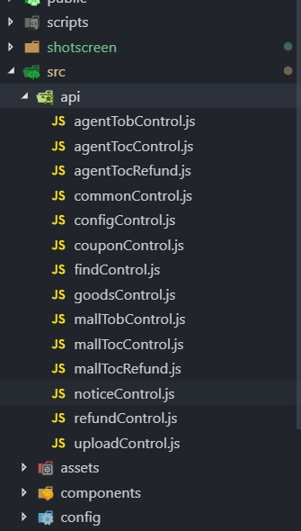
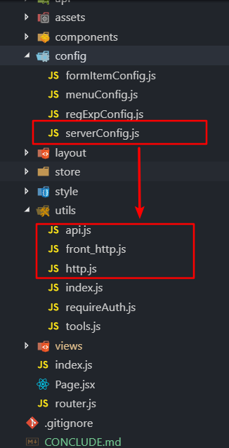
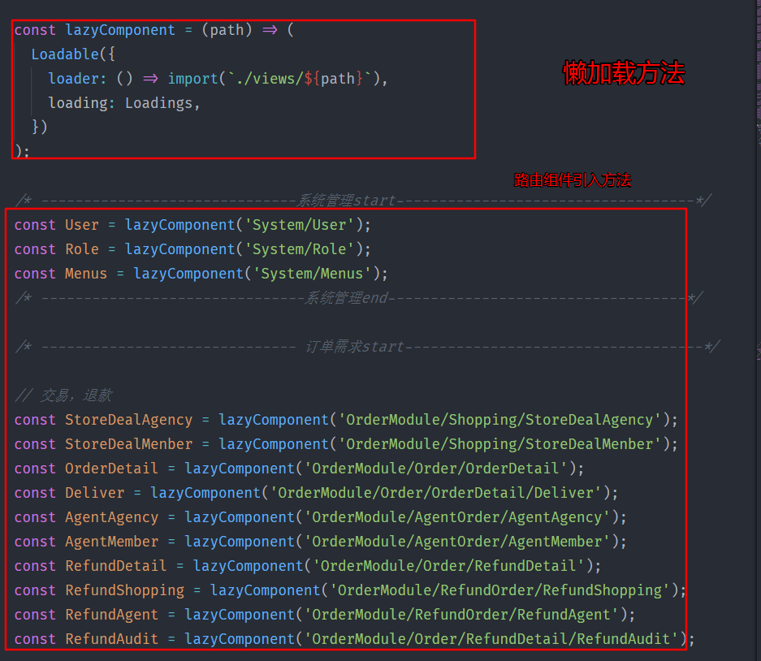

## 订单后台项目优化和总结
> 项目前期是由一个人进行独立负责和开发，之后变成了三人开发。由于另外俩人的介入，导致项目初期的一些结构和公用组件可能要进行调整。这期间主要是由一个人来维护整体架构。随着对业务以及代码逻辑的熟悉，逐步进步到三个人共同维护。
### 一、项目优化
#### 项目目录整理
```
YshuAdminWap
└─ src
       ├─ Page.jsx                        // 页面入口文件
       ├─ api                             // api存放目录
       │    ├─ cloudStoreApi              // 云仓项目api
       │    ├─ orderApi                   // 订单项目api
       │    └─ system                     // 系统模块api
       ├─ assets                          // 静态文件存放
       │    └─ images
       ├─ components                      // 公用组件
       │    ├─ BaseTextArea
       │    ├─ BaseTextArea1
       │    ├─ BreadcrumbCustom
       │    ├─ CodeModal
       │    ├─ ImgModal
       │    ├─ Loadings
       │    ├─ RichText
       │    ├─ SelectGoods
       │    ├─ SmallTitle
       │    ├─ Smallware
       │    └─ TabSwitch
       ├─ config                        // 配置文件
       │    ├─ formItemConfig.js
       │    ├─ menuConfig.js
       │    └─ regExpConfig.js
       ├─ index.js                      // 项目入口文件
       ├─ layout                        // 布局组件
       │    ├─ Headers
       │    ├─ NavLeft
       │    ├─ index.js
       │    ├─ index.less
       │    └─ store
       ├─ router.js                     // 路由配置文件
       ├─ server                        // 请求封装
       │    ├─ front_http.js            // 前台接口统一配置
       │    ├─ http.js                  // 后台接口统一配置
       │    └─ serverConfig.js          // 公司后端人员接口
       ├─ store                         // redux状态管理
       │    ├─ index.js
       │    └─ reducers.js
       ├─ style                         // 项目公共样式
       │    ├─ common.less              // 公用css样式
       │    ├─ default.less             // 常用变量
       │    ├─ mixins.less              // css混合器
       │    ├─ reset.less               // css重置样式
       │    └─ theme.less               // 自定义antd样式
       ├─ utils                         // 常用工具方法
       │    ├─ buttonAuth.js
       │    ├─ index.js
       │    ├─ requireAuth.js
       │    └─ tools.js
       └─ views                         // 页面目录
              ├─ CloudStoreModule       // 云仓项目
              ├─ Home                   // 首页
              ├─ Login                  // 登录
              ├─ OrderModule            // 订单项目
              └─ System                 // 权限管理
```
之前的`api、config、assets、views`是这样的:
<figure>
  
</figure>

在小组成员的共同努力之下，我们完善了目录结构，不仅实现了模块化，还根据公司的开发项目计划进行了目录设计(订单，云仓)，使目录结构一目了然

#### 项目路由懒加载
> 经测试，在路由较少的时候路由懒加载并不会提高很多加载性能，但是页面切换时的`loading`效果很好的增加了用户体验

随着项目需求的不断增加，伴随着的就是组件、页面、以及相应路由的增加，这样会导致打包后的`bundle.js`文件不断扩大。这里我们在路由配置的时候进行了懒加载，跳转到对应的路由时加载对应的组件资源，而不是在首次进入时加载全部资源。


### 二、注意点
* Antd 上传组件 上传失败错误捕获， 上传状态 done 不代表上传成功， 上传过程中再次点击上传会出错
* 列表页，点击页码调用接口要传递搜索的参数， 点击页面条目数调用接口前要重置页码
* React 生命周期componentWillReceiveProps 要谨慎使用，避免在该生命周期里影响父组件渲染state造成死循环
* <font color="red">Antd 下拉组件有时候要设置定位的父元素，默认父元素为body</font>
* Antd 的form组件子节点的值的属性不一定都是value，如 Switch 的是 'checked'，可以通过options的valuePropName属性来修改
* 后台接口返回的数据可能为null，要做好兼容处理
### 三、项目目前不足
#### 优化懒加载
目前的路由懒加载是通过第三方的模块来实现，而在最新稳定版本的`react`中是将这个功能在内置`api`中进行了提供。这样，我们可以不再使用第三方模块，减少代码体积
#### 异步请求取消
这部分内容分为俩点：  
* 当页面接口请求出错的时候，`loading`效果会一直存在
* 当进入页面并发起请求时，如果在请求未结束的情况下进行页面跳转，控制台会进行报错。这里可能会用到`axios`的取消请求功能来进行优化
#### 升级`react-create-app`到新版
项目在开发过程中并没有很好的处理`css`的全局污染情况。而在新版的`react-create-app`中有对`css-modules`进行一个内置，可以达到旧有`css`和新的模块化`css`的完美结合，有效避免`css`样式的污染
#### `Mock`服务器稳定性
项目整体采用前后端分离模式进行开发，在开发过程中，前端通过`mock.js`来进接口请求过程以及返回数据的模拟。在这个过程中比较困扰开发的因素有俩个：  
1. `mock`服务器不稳定，导致开发到一半很难继续进行
2. `swagger`的同步功能有一些问题，有时候同步不下来，并且每次同步都需要上传`.json`文件，比较麻烦


### 四、小结
整个项目并没有在预定时间内很好的完成，原因能想到的如下：  
* 在项目开始阶段，并没有能很好的理解需求的难易程度
* 结合自身水平和需求对时间的评估并没有一个很好的预期
* 一个模块后端同事要有好几个人来对接，导致对需求并没有连贯的理解
* 后端同事任务比较多，不能专门抽出时间专心与前端同事对接

整个项目随着团队成员的努力，在向一个更加美好的方向发展。  
今天，真好!未来，会更好！！！
